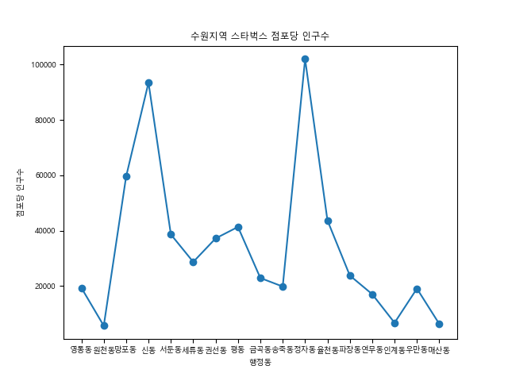

# 수원 스타벅스 점포당 인구수

<body>
  
수원지역의 스타벅스 매장수를 조사하고 공공데이터로 점포당 인구수를 파악한다

  
- 수원지역 스타벅스 매장의 위치 및 지점수를 스타벅스 홈페이지 데이터를 사용해 파악한다.
- 공공데이터에서 수원 지역 각 동의 인구현황을 얻는다.
- 수원지역 각 동의 점포당 인구수를 파이썬을 사용해서 그래프로 표시한다.
- 점포당 인구수가 많은 곳을 선택해서 스타벅스 신규 매장 입점을 고려한다.
- 지역별 소득수준, 주 소비층 인구 등 추가 데이터를 수집하여 결론을 검증할 필요가 있다

<결과: Figure_1 첨부>
   
</body>
